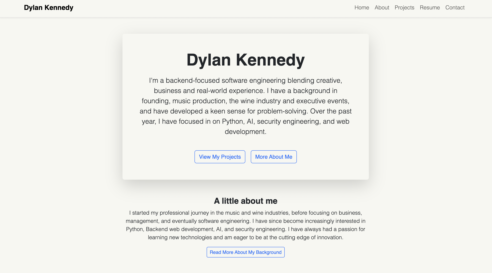
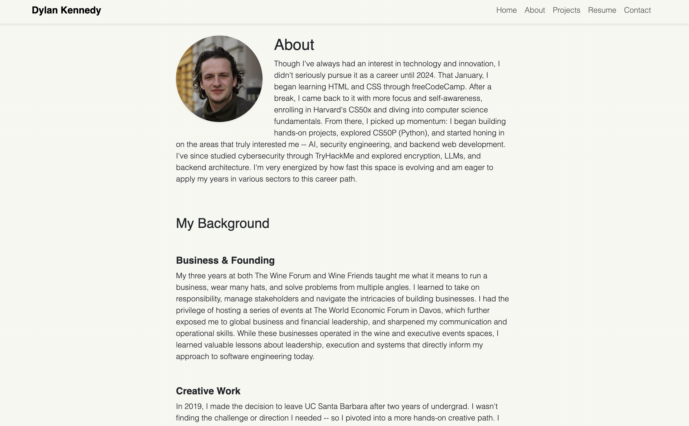

# Dylan Kennedy – Personal Portfolio Website

Welcome to my personal portfolio website! This project showcases my work as a self-taught backend-focused developer with a background in business, music production, and event management. Built with Django, Bootstrap, and SQLite3, it highlights my background, projects, resume, and more.

---

## Features

- **Landing Page** with intro and quick access to projects and resume  
- **About Page** showcasing my background across industries  
- **Projects Page** dynamically rendered from Django admin and contiuously updated as more projects are created
- **Resume** up-to-date resume  
- **Contact Form** with success messages and database storage  
- **Admin Panel** for managing projects, resume, and contact submissions  

---

## Tech Stack

- **Language:** Python
- **Framework:** Django
- **Database:** SQLite3  
- **Styling:** Bootstrap 5 + Custom CSS  
- **Templating:** Django Templates  
- **Admin:** Customized Django Admin

---

## Screenshots

---

## Notes
I wanted to create a personal portfolio website to showcase my projects, summarize my background and to act sort of as a cetnralized repository. I will use this site as a place to showcase projects, resumes, and work experience. It will be interactive and continuously expanding. 